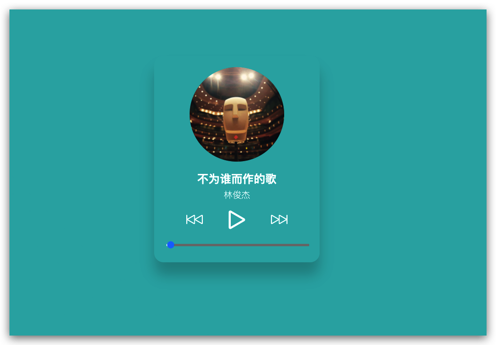

# mini-function

该项目收集实现一些好看或者好用的`小功能`或者`小组件`，里面讲解了一些功能实现的思路及详细实现源码

## 功能说明

- [react-audio-player](./react-audio-player) react 实现的音乐播放器
- [set-color-by-image](./set-color-by-image) 根据图片设置主题色

## 截图

- react-audio-player
  

- set-color-by-image
  
